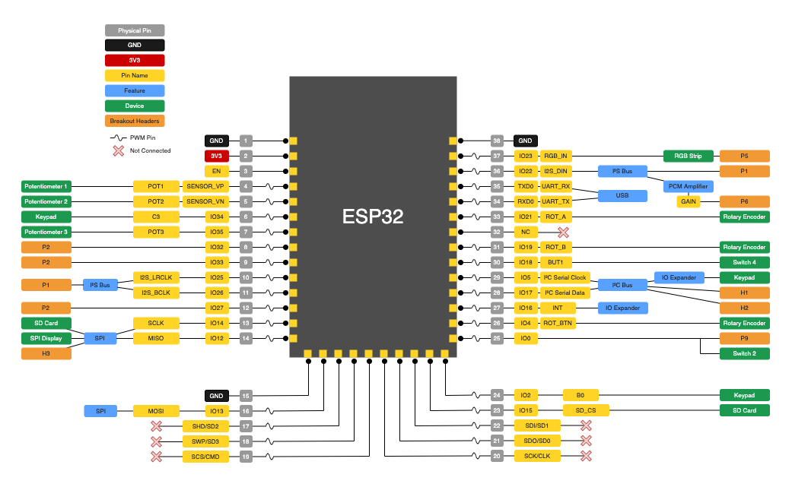

# AmpySynth!

## Specifying version

For AmpySynth Revision 1 (no buttons on left side, labeled v1.0), omit the hardware revision flag.
For AmpySytnh Revision 2 (buttons on side, labeled v1.1), ensure that `build_flags` includes `-DAMPYSYNTH_V1_1` in your platformio.ini

## Upload over network from PlatformIO

Uncomment the line `upload_port = 192.168.1.100` and change it to the IP address of your AmpySynth to upload over the network. You can then use the Upload button in PlatformIO to update your AmpySynth.

## Uploading to filesystem

Once your upload port is set to an IP address, you can upload files to the SPIFFS filesystem using the command `platformio run --target uploadfs --environment esp32dev` or click "Upload Filesystem Image" in PlatformIO.
_Note_ Don't use the "Upload Filesystem Image OTA" option, as this sends the wrong settings.

## Displays

### 240x240 IPS LCD ST7789

To use this LCD module add the flag `-DLCD_240_240` to `build_flags`
